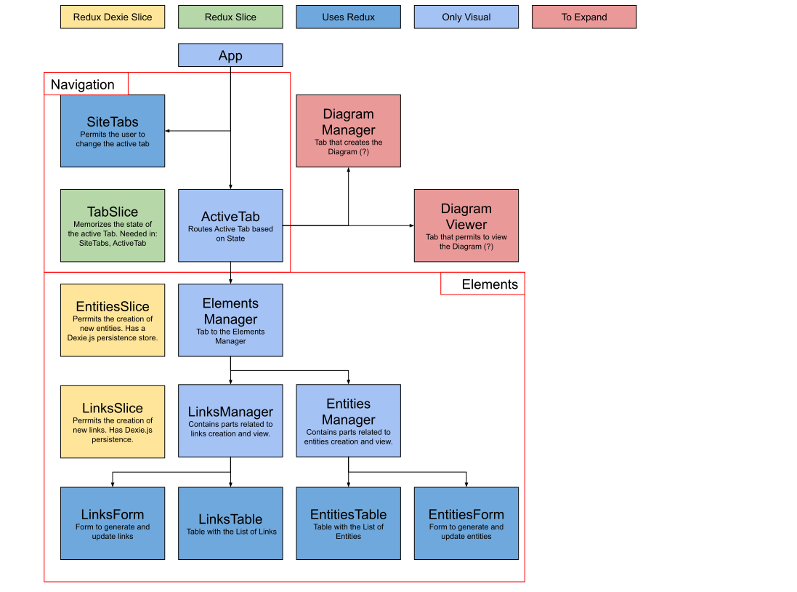

# DiagramMaker
It will be a site that permits
1. Create Jsons with "entities" and "links" 
2. Set up the settings to make diagrams
3. A React graphical library thats makes diagram based on a Json

## Structure 

Project will be made using React + Redux, because the variables in the diagram making part should be received from the entity creation part.

## Diagram settings:
- Layout 
 - Topological (entities are spread from left to right / right to left / etc based on a topological sort )
 - ???
- Directionality (how should the graph bbe oriented. In topological case "from left to right" means that the "first entities" will start from the right)
 - Left To Right
 - Right To Left
 - Up to Down
 - Down to Up
 - ??
- Entities Shape
 - Circle
 - Square
- Link Type
 - Straight
 - Smooth
 - Square 

## What UI
There are many kinds of components collections. The one I tried (mdbootstrap) is pay-gated for a lot of things, so I'll move to Material UI.
